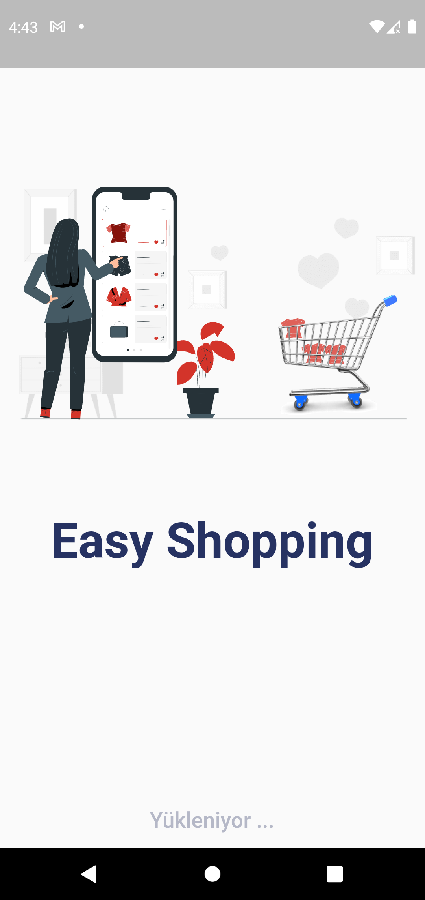
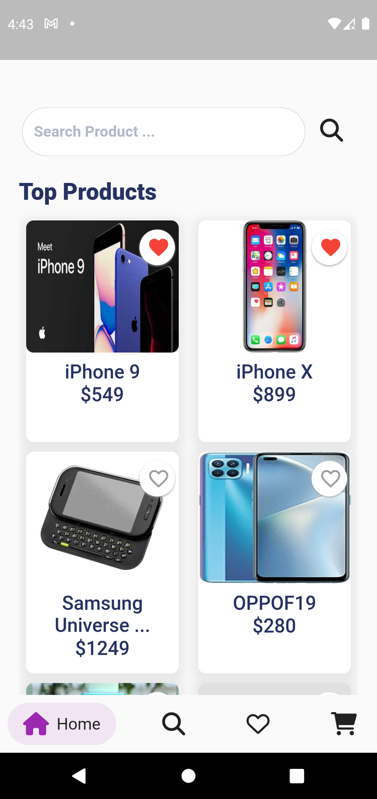
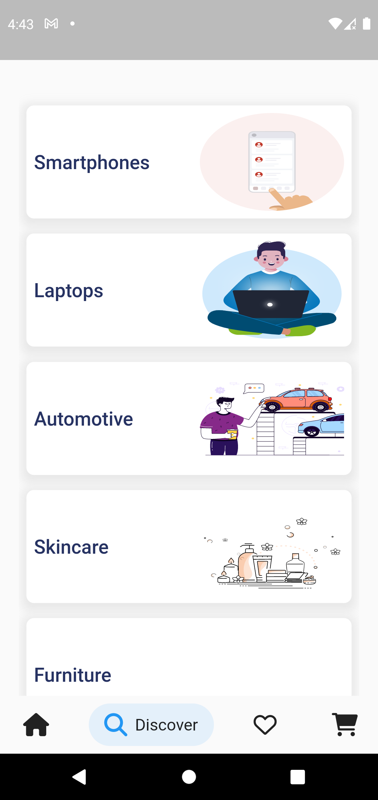
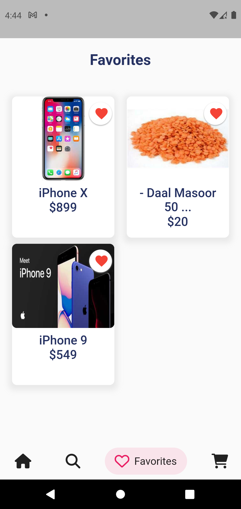
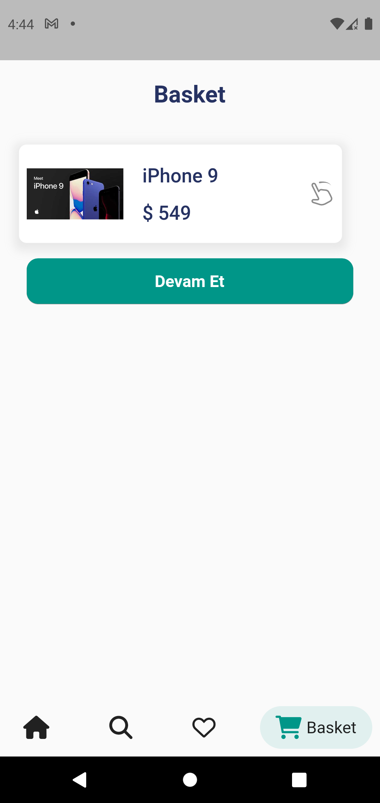
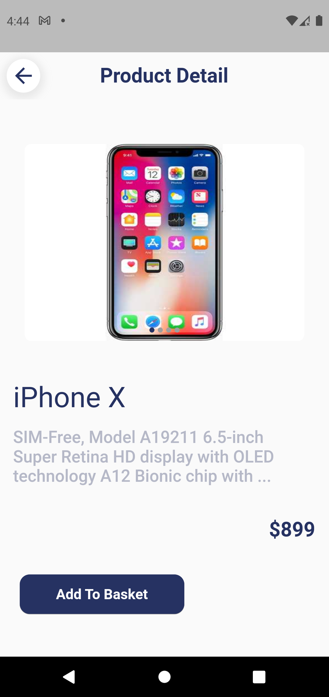

# Marketing App

Actually this project is my homework of my design patterns lesson . I had use 4 design patterns in this project. Firstyle this project actually like E-commerce app . We can see products , add products to basket or remove of basket , add products to favorites and make pay . I used bloc state management and vexana network manager package.

## Screenshots

